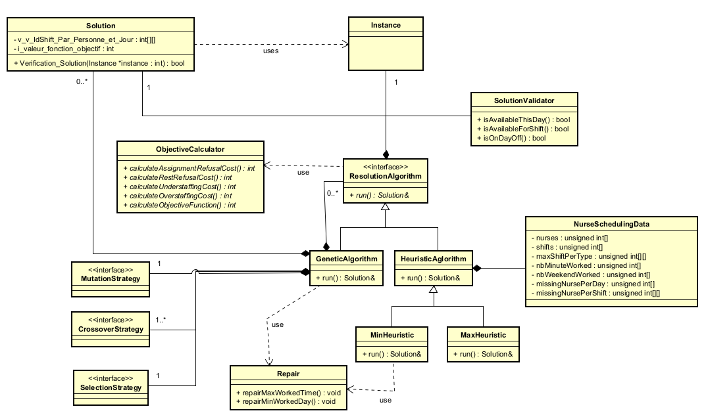

# Nurse Scheduling Design Problem

The goal of the project is to assign each person to shifts over the planning horizon in order to correctly meet the required number of staff for each shift while taking individual preferences into account.

## Learnings

- Problem solving and analysis
- Solving constrained optimization problems
- Genetic algorithm implementation
- Solution architecture design
- Evaluation of the impact of different strategies on solution quality and performance

## Constraints

- Each person can work only one shift per day.
- Certain shifts cannot be scheduled consecutively.
- The maximum number of shifts assignable to a person must be respected.
- The maximum and minimum total number of minutes worked by each person must be respected.
- The maximum and minimum number of consecutive shifts must be respected.
- The minimum number of consecutive days off must be respected.
- Days off must be respected.
- The maximum number of weekend working days (Saturday or Sunday) must be respected.

## Preferences

- A weight for each extra person working on a given shift and day.
- A weight for each missing person on a given shift and day.
- A weight for each instance where a person prefers to work a given shift on a given day.
- A weight for each instance where a person prefers not to work a given shift on a given day.

## Datas

| Name | Number of Days | Number of People | Number of Shifts | Lower Boundary | Best Solution Possible |
|----------|------------|------------|------------|------------|------------|
| Inst1 | 14 | 8 | 1 | 607 | 607 |
| Inst2 | 14 | 20 | 3 | 1001 | 1001 |
| Inst3 | 28 | 10 | 2 | 1716 | 1716 |
| Inst4 | 28 | 16 | 2 | 1143 | 1143 |
| Inst5 | 28 | 20 | 3 | 1056 | 1056 |
| Inst6 | 28 | 30 | 4 | 1300 | 1300 |
| Inst7 | 28 | 36 | 4 | 439 | 439 |
| Inst8 | 28 | 40 | 5 | 4631 | 4631 |
| Inst9 | 28 | 60 | 10 | 4040 | 4040 |
| Inst10 | 28 | 120 | 18 | 1348 | 1348 |
| Inst11 | 42 | 32 | 4 | 1278 | 1278 |
| Inst12 | 42 | 45 | 6 | 3823 | 3834 |
| Inst13 | 56 | 20 | 3 | 3225 | 3225 |
| Inst14 | 84 | 22 | 3 | 4459 | 4459 |
| Inst15 | 84 | 40 | 5 | 3148 | 3149 |
| Inst16 | 182 | 100 | 8 | 21124 | 21159 |
| Inst17 | 364 | 50 | 10 | 28997 | 31279 |
| Inst18 | 364 | 150 | 32 | 26571 | 42463 |

## Features

Genetic algorithm with:
- Heuristic-based solution initialization
- Tournament selection
- Multiple crossover operators
    - Uniform crossover
    - Two-point crossover on rows
    - Two-point crossover on columns
- Mutation operator (shift swapping)
- Automatic repair of infeasible solutions
- Separate objective (fitness) evaluation module

## Architecture

